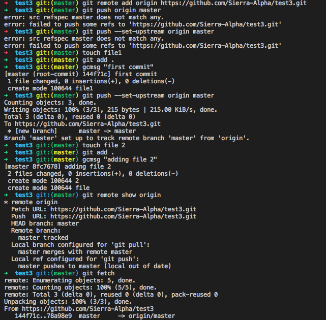
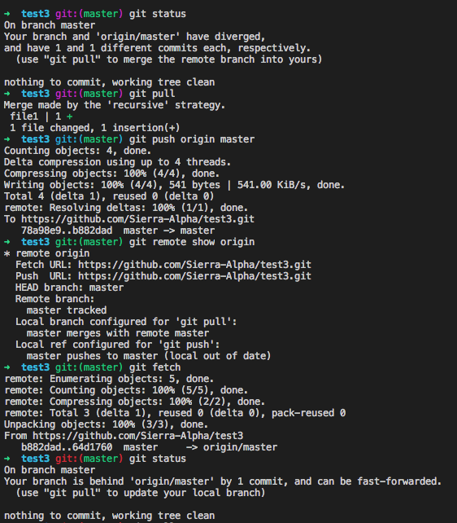
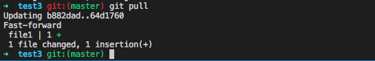
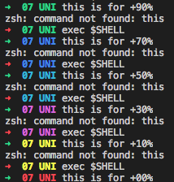

# ZSH_Custom

Just my custom Zsh settings to get a nice looking terminal prompt.

if you load the files into your '.oh-my-zsh/custom' folder you'll have the same beautiful prompt

you'll need to move your ~/.zshrc to ~/.oh-my-zsh/custom/ and then symlink it back using `ln -s ~/.oh-my-zsh/custom/.zshrc .zshrc` if you want the custom options like removing duplicates in up arrow history

## Contents:

- [ZSH_Custom](#zsh_custom)
  * [Contents](#contents)
  * [Git status prompt colours](#git-status-prompt-colours)
    * [Colour Meaning](#colour-meaning)
      * [BRANCH](#branch)
      * [git:( + )](#git--)
  * [Battery percent prompt colours](#battery-percent-prompt-colours)
  * [Runc](#runc)
  * [Github Create Repo](#github-create-repo)
  * [Github Initialise local, create remote and link](#github-initialise-local-create-remote-and-link)

## Git status prompt colours

syntax = 'git:( BRANCH )'

'git:(' and ')' are the `ZSH_THEME_GIT_PROMPT_PREFIX` and the `ZSH_THEME_GIT_PROMPT_SUFFIX` respectively, referred to as 'git:( + )' from now on (as the prefix and suffix are always a matching colour)

BRANCH is the current branch checked out

### Colour Meaning

#### BRANCH

  Green   = Nothing to commit and working tree is clean
  Yellow  = Untracked, not staged files present, add and commit to get to BRANCH = green

#### 'git:( + )'

  Green   = Remote exists and is same as local
  Yellow  = Remote doesn't exist or hasn't been set with: `git remote add origin https/some/url/here.git`
  Magenta = Diverged state, some commits have been made locally and some have been made on remote separately (see note below)
  Cyan    = Local is ahead of tracked HEAD (not necessarily remote see note below)
  Red     = Local is ahead of tracked HEAD (not necessarily remote see note below)
  
#### Note
  The tracked HEAD is local, to see remote status try 'git remote show origin', to get full functionality use 'git fetch' to    update local tracked HEAD to match remote, this will not overwrite local files but allow the functions for comparing to the remote to calculate correctly, this is specific to the Magenta, Cyan and Red displays.
  
Below is a screen shot:

it shows the following pseudo steps:
  1.  Repository exists locally and on remote but is not yet set with the `git add remote https/some/url/here` command
  2.  Shows the BRANCH colour changing based on the local working tree status
  3.  Equal remote and local,      clean working tree    (green and green)
  4.  Equal remote and local,      dirty working tree    (green and yellow)
  5.  Remote behind local,         clean working tree    (blue and green)
  6.  In the mean time I added some files directly to the remote, you can see this in the output from `git remote show origin`
  7.  Used fetch to update the tracked HEAD to match the remote
  8.  Diverged remote and local,   clean working tree    (magenta and green)
  9.  Pull down remote changes, now local is ahead of remote
  10. Remote behind local,         clean working tree    (blue and green)
  11. Equal remote and local,      clean working tree    (green and green)
  12. Changed some files only on the remote,  you can see this in the output from `git remote show origin`
  13. Used fetch to update the tracked HEAD to match the remote
  14. Remote ahead of local,       clean working tree    (red and green)
  15. `git pull`
  16. Equal remote and local,      clean working tree    (green and green) - "Ahh thats better, whew" - Shaun

## Battery percent prompt colours

Hope fully thats self explanatory, only works for macOS currently but easy to modify the battery_prompt_colour.zsh as per the comments found in it. Feel free to open up a pull request if you implement it.

## Runc

`Runc` is a little script to make, run and then remove the executable file, it takes a c or cpp file as an argument and compiles it and runs it. Full credit to [Ben Allen](@bballenn).

## Github Create Repo

use `ghrc <username> <reponame> -p -d <description>`

`-p                = use this option to set github repo as private`
`-d (optional)     = a description and requires a description after it`

to create a repo online at github, it will prompt you to enter your password.

username is the github username for the repository

requires the alias.zsh file for this shor command.

## Github Initialise local, create remote and link

use `ginit` (same arguments as [Github Create Repo](#github-create-repo)) to run the initialise the directory with git, create a readme, stage the changes commit them, then uses [Github Create Repo](#github-create-repo) to create a remote repo and to set the origin to this remote and then link the local to the remote
